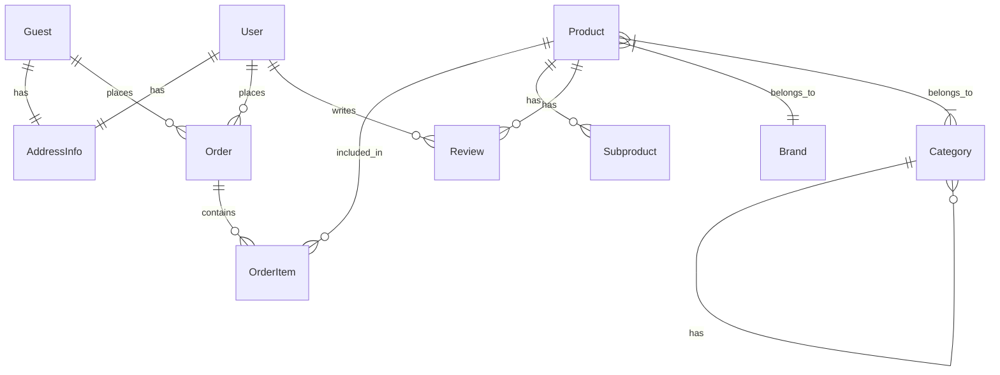

# Database Structure Documentation

## Models and Relationships

### User
- Fields:
  - name (string)
  - email (string, unique)
  - email_verified_at (timestamp)
  - password (string, hashed)
  - remember_token (string)
  - role (string) - ['admin', 'driver']
  - id_address_info (foreign key)
- Relationships:
  - belongsTo AddressInfo
  - hasMany Order
  - hasMany Review

### AddressInfo
- Fields:
  - name (string)
  - address (string)
  - city (string)
  - postal_code (string)
  - country (string)
  - phone (string)
- Relationships:
  - hasOne User
  - hasOne Guest

### Guest
- Fields:
  - email (string)
  - phone (string)
  - id_address_info (foreign key)
- Relationships:
  - belongsTo AddressInfo
  - hasMany Order

### Product
- Fields:
  - name (string)
  - description (text)
  - available (boolean)
  - brand_id (foreign key)
  - created_at (timestamp)
  - updated_at (timestamp)
- Relationships:
  - belongsTo Brand
  - hasMany Subproduct
  - hasMany Review
  - belongsToMany Category (through ProductCategory)
  - hasMany OrderItem

### Subproduct
- Fields:
  - name (string)
  - price (decimal)
  - available (boolean)
  - product_id (foreign key)
  - created_at (timestamp)
  - updated_at (timestamp)
- Relationships:
  - belongsTo Product

### Category
- Fields:
  - name (string)
  - description (text)
  - slug (string)
  - parent_id (foreign key, nullable)
  - created_at (timestamp)
  - updated_at (timestamp)
- Relationships:
  - belongsTo Category (parent)
  - hasMany Category (children)
  - belongsToMany Product (through ProductCategory)

### Order
- Fields:
  - user_id (foreign key, nullable)
  - guest_id (foreign key, nullable)
  - items (json)
  - total (decimal)
  - status (enum) - ['pending', 'processing', 'completed', 'cancelled']
  - payment_status (enum) - ['pending', 'paid', 'refunded']
  - shipping_status (enum) - ['pending', 'shipped', 'delivered']
  - shipping_address (json)
  - billing_address (json)
- Relationships:
  - belongsTo User
  - belongsTo Guest
  - hasMany OrderItem

### OrderItem
- Fields:
  - order_id (foreign key)
  - product_id (foreign key)
  - quantity (integer)
  - price (decimal)
- Relationships:
  - belongsTo Order
  - belongsTo Product

### Review
- Fields:
  - rating (integer)
  - comment (text)
  - product_id (foreign key)
  - user_id (foreign key)
  - created_at (timestamp)
  - updated_at (timestamp)
- Relationships:
  - belongsTo Product
  - belongsTo User

## Database Diagram



## Notes
- The system supports both registered users and guests for placing orders
- Categories can have hierarchical structure (parent-child relationships)
- Products can have multiple subproducts (variants)
- Address information is stored separately and shared between users and guests
- Orders maintain both shipping and billing addresses as JSON for historical accuracy
``` 